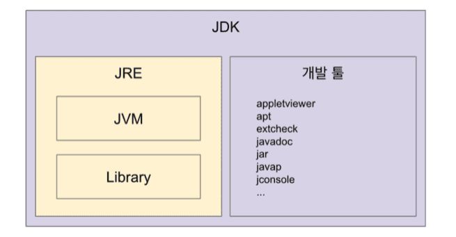
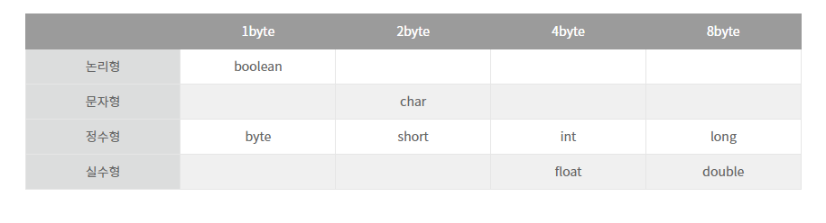
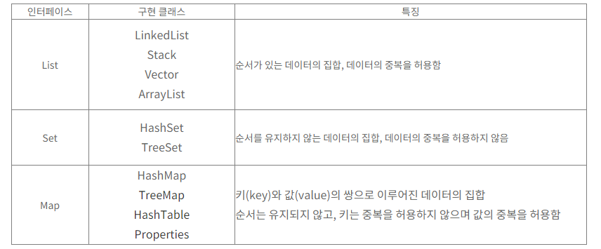

## java

### JDK,JRE,JVM 포함 관계
 - JVM : JVM은 OS와 Java 애플리케이션 사이의 중개자 역할을 한다. JVM은 자바 바이트코드를 실행할 수 있는 환경을 제공하여 자바 바이트 코드가 플랫폼에 독립적으로 어디서든 실행가능
 - JDK : 자바 개발도구(Java Development Kit)
 - JRE : 자바 구동 환경으로, 시스템 라이브러리와 JVM을 포함

###

### 플랫폼 독립성
     .exe => window
     .app => ios
     .sh => rinux
     .class => JVM을 활용하여 기계어로 변환함으로써 모든플랫폼에서 사용가능하게함 (자바)
###

### 자바의  실행순서
    프로젝트 생성 => 패키지 생성 => 소스파일생성 => 바이트코드생성 => 실행
###

### 자바의 변수 타입

###

### 절차지향
  - 기능 중심적 프로그래밍 , 순서에 맞춰 단계적으로 실행
###

### 객체지향 (java,python,c++ 등)
   - 객체 중심적 프로그래밍 , 객체 단위로 실행
   - 객체 : 동일한 성질의 데이터와 메소드를 모아두고 필요에 따라 언제든 이용할수 있게 만들어 놓은 것 
   - 객체지향의 문법요소
       - 클래스 : 객체를 정의하는 틀 또는 설계도
            - 일반클래스
            - 추상클래스
              - 기능이 정의되지 않은 미완성 메소드를 포함하는 클래스
       - 인터페이스 - 구현된 것이 없는 밑그림만 있는 설계도 (다중상속 가능)

       - 클래스의 내부 구성요소
           - 필드 : 클래스의 속성을 나타내는 변수(필드변수)
           - 메소드 : 클래스가 지니고있는 기능(함수)
           - 생성자 : 클래스의 객체를 생성하는 역할 , 리턴타입 X
           - 이너클래스 : 클래스내부에 포함되는 클래스
###

### 다형성 
 - 하나의 클래스나 메소드를 여러가지 방법으로 사용하는 개념. 다양한 자료형에 속하는 것이 가능하도록 하는 성질.
 - 다형성의 종류
    - 오버로딩 : 동일한 이름의 메소드명에 매개변수만 다르게 사용
    - 오버라이딩 : 상위클래스에서 상속받은 메소드를 하위클래스에서 재정의하여 사용
###

### 접근 제어자
  - public : 동일패키지의 모든클래스 + 다른패키지의 모든 클래스에서 사용가능
  - protended : 동일패키지의 모든클래스 + 다른패키지의 자식클래스에서 사용가능
  - default : 동일패키지의 모든클래스에서 사용가능
  - private : 동일 클래스에서 사용가능
###

### 필드
 - 인스턴스 필드 : 클래스의 인스턴스를 생성해야만 접근할 수 있는 필드를 말한다.객체를 생성 후 사용가능
 - 정적 필드 : 정적 필드(Static Field)는 자료형 앞에 static 키워드를 이용해서 선언한 필드를 말한다. 객체생성 없이 사용가능 
###

### 가비지 컬렉션(GC)
 - 자바의 메모리 관리 방법
 - JVM의 힙영역에서 동적으로 할당된 메모리중 필요없어진 메모리영역을 주기적으로    삭제하는 프로세스
 - 단점 
    - 메모리가 해제된 시점을 정확히 알수 없다.
    - GC가 동작되는 동안 다른동작이 멈추기 때문에 오버헤드 발생
        - 오버헤드 : 어떤 처리를 하기위해 들어가는 간적접 처리시간

###

### 제네릭
 - 자바에서  안정성을 맡고있으며 , 다양한 타입의 객체를 다루는 메소드나 Collection 클래서 가능하고, 컴파일 과정에서 타입체크를 해주는 기능
 
 - ※ 실용성이 떨어지는 상황들이 생기면서, 모든 타입을 대신할 수 있는 와일드카드 타입(<?>)을 추가
###

### 컬렉션 
 - 다수의 데이터를 쉽고 효과적으로 처리할 수 있는 표준화된 방법을 제공하는 클래스의 집합

 
 
 - 컬렉션의 상세정보   
 https://hwan1001.tistory.com/10
### 

## spring

### Spring을 사용하는 이유
 -  DI를 통해 단위 테스트를 가능하게 하고, AOP를 통해 복잡한 코드를 감소하여 개발자의 생산성을 향상시키고, 유지보수 비용을 감소시키는 효과를 줌
###

### Spring Framework
- 의존성 주입(DI) : 의존성 주입은 필요한 객체를 직접 생성하는 것이 아닌 외부로부터 객체를 받아서 사용하는 것
- 제어의 역전(IoC) : 모든 객체에 대한(생성, 라이프사이클 등) 제어권을 개발자가 아닌 IoC 컨테이너에게 넘긴 것
- 관점 지향 프로그래밍(AOP, Aspect-Oriented Programming) : 핵심 비즈니스 로직에 있는 공통 관심사항을 분리하여 각각을 모듈화 하는 것
###

### 비동기 처리
 - @RequestBody :  클라이언트가 전송하는 JSON 형태의 HTTP Body 내용을 MessageConverter를 통해 Java Object로 변환시켜주는 역할
 - @RequestParam : 1개의 HTTP 요청 파라미터를 받기 위해 사용
 - @ModelAttribute : HTTP Body 내용과 HTTP 파라미터의 값들을 생성자,Getter,Setter를 통해 주입하기 위해 사용
###

### MVC
 - MVC는 Model, View, Controller의 약자이며, 각 레이어간 기능을 구분하는데 중점을 둔 디자인 패턴
 - Model : 데이터 관리 및 비즈니스 로직을 처리하는 부분, (DAO, DTO, Service 등)
 - View : 비즈니스 로직의 처리 결과를 통해 유저 인터페이스가 표현되는 구간
 - Controller : 사용자의 요청을 처리하고 Model과 View를 중개하는 역할
###

### CRUD
  - CRUD란 Create(생성), Read(읽기), Update(갱신), Delete(삭제)을 일컫는 말
###

## SQL

### JOIN
 - 조인 : 두 개의 테이블을 서로 묶어서 하나의 결과를 만들어 내는 것
###

### 쿼리 진행순서
 - FROM, ON, JOIN > WHERE, GROUP BY, HAVING > SELECT > DISTINCT > ORDER BY > LIMIT
###

## 기타

### http와 https 차이점
 - http(Hyper Text Transfer Protocol) : 서버/클라이언트 모델을 따라 데이터를 주고 받기 위한 프로토콜
 - https(Hyper Text Transfer Protocol Secure) :  HTTP에 데이터 암호화가 추가된 프로토콜
    -  대칭키 암호화와 비대칭키 암호화를 모두 사용하여 빠른 연산 속도와 안정성이 높다
       - 대칭키 암호화 : 클라이언트와 서버가 동일한 키를 사용해 암호화/복호화를 진행함
          키가 노출되면 매우 위험하지만 연산 속도가 빠름
       - 비대칭키 암호화 :1개의 쌍으로 구성된 공개키와 개인키를 암호화/복호화 하는데 사용함 키가 노출되어도 비교적 안전하지만 연산 속도가 느림
 - 차이점 : 
    - 1. HTTP는 암호화가 추가되지 않았기 때문에 보안에 취약한 반면, HTTPS는 안전하게 데이터를 주고받을 수 있다  
    - 2. HTTPS를 이용하면 암호화/복호화의 과정이 필요하기 때문에 HTTP보다 속도가 느리다
    - 3. HTTPS는 인증서를 발급하고 유지하기 위한 추가 비용이 발생

###

### git과 svn차이점
 - git : 분산관리식
    - 개발자가 자신만의 commit history를 가질 수 있고, 개발자와 서버의 저장소는 독립적으로 관리가 가능
    - commit한 내용에 실수가 있더라도 바로 서버에 영향을 미치지 않음
    - 개발자는 마음대로 commit(push)하다가 자신이 원하는 순간에 서버에 변경 내역(commit history)을 보낼 수 있으며, 서버의 통합 관리자는 관리자가 원하는 순간에 각 개발자의 commit history를 가져올 수 있음
    - 단점 : 사용하기 어려움이 있다.
 - svn : 중앙집중식 

    - SVN은 보통 대부분의 기능을 완성해놓고 소스를 중앙 저장소에 commit
    - commit의 이미 자체가 중앙 저장소에 해당 기능을 공개 
    - 단점 : 저장소를 한개만 두는 것의 단점은 만약 데이터가 소실되었을때 복구가 어렵다.
    ###
